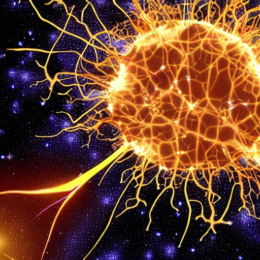

# Slide1
## Subtitle

---
layout: center
packed_images: false
crop_images: false
---

* layout: center
* Three images
* And the final bullet

# Latex and formatting

---
background_color:
- 255
- 255
- 255
layout: center
text_color:
- 0
- 0
- 0
---

A bit *of italic*
$a = \frac{b}{c}$
And **a bold thing**, too.
Testing [linking](to_some_target), too.
Testing linking, too.
A text, following with a $\frac{formula}{divisor}$

# Images side-by-side

---
hidden: false
layout: image_fill
text_color:
- 255
- 100
- 100
---

&nbsp;

