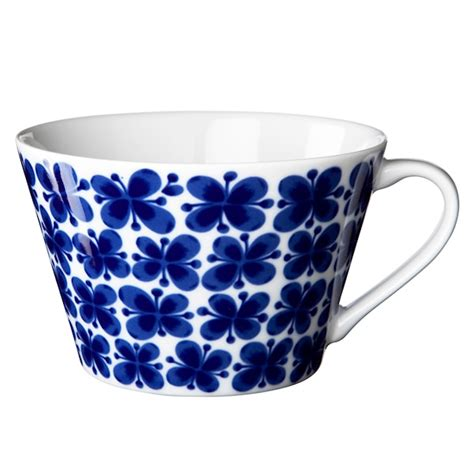

# Slide1

[//]: # ({"layout": "center", "packed_images": false, "crop_images": false})

* layout: center
* Three images
* And the final bullet

# Image left

[//]: # ({"layout": "image_left_half", "packed_images": true})

* layout: image_left_half
* packed_images: true
* And the final bullet

# Image left small

[//]: # ({"layout": "image_left_small", "packed_images": false, "crop_images": true})

* layout: image_left_small
* Another bullet
* And the final bullet

# Image right

[//]: # ({"layout": "image_right_half", "packed_images": true})

* One bullet
* Another bullet
* And the final bullet

# Image right small

[//]: # ({"layout": "image_right_small"})

* One bullet
* Another bullet
* And the final bullet

# Center again, not cropping

[//]: # ({"layout": "center", "crop_images": false})

* One bullet
* Another bullet
* And the final bullet

# Image center

[//]: # ({"layout": "image_center", "crop_images": true})

* Default cropping
* Another bullet
* And the final bullet

# Image fill

[//]: # ({"layout": "image_fill", "text_color": [0,0,140]})

* The image_fill layout puts image as background, with or without text.
* Another bullet: $a = \frac{b}{c}$
* And the final bullet

# Black slide

[//]: # ({"background_color": [0,0,0], "text_color": [255,255,255]})

* Only bullet

# Latex and formatting

[//]: # ({"layout": "center", "background_color": [255,255,255], "text_color": [0,0,0]})

A bit *of italic*
$a = \frac{b}{c}$
And **a bold thing**, too.
Testing [linking](to_some_target), too.
A text, following with a $\frac{formula}{divisor}$

# Some more strangeness

[//]: # ({"layout": "center", "background_color": [255,255,255], "text_color": [0,0,140]})

$a = \left(\frac{\frac{\sum_i^N X_i^2}{y}}{c}\right)$
* (link)[#Slide1]

# Another formula

* A small one $a = b * c$ this time.

--------------------------

* Another bullet

# Two column layout

[//]: # ({"layout": "center", "columns": 2})

* First bullet
* Second bullet

--------------------------

* Third bullet
* Fourth bullet

# Three column layout

[//]: # ({"layout": "center", "columns": 3, "crop_images": false})

* First bullet
* Second bullet

--------------------------

* Third bullet
* Fourth bullet

--------------------------

* Fifth bullet
* Sixth bullet

# Thank you 

[//]: # ({"layout": "image_right_half"})

# Level four headlines
## create boxes

[//]: # ({"layout": "image_right_half"})

&nbsp;

#### 

Writing a lot of cool things in a box.
Maths: $\mathbf{x} = \sum_{i=0}^N x_i$

#### 

We can fill a page with boxes.

#### Really fill.

#  

[//]: # ({"layout": "center"})

&nbsp;
(Thank you!)[#Latex and formatting]

